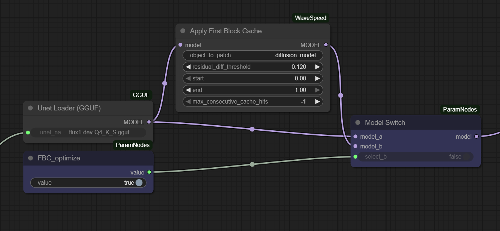

---

# ComfyUI-ParamNodes

**ComfyUI-ParamNodes** is a lightweight, dependency-free collection of custom nodes for ComfyUI, designed to parameterize your workflows for API-driven generation. It provides a clean set of input nodes to control strings, numbers, booleans, and model/LoRA selections, along with a simple logic switch for conditional execution.

This toolkit is ideal for developers who need to integrate ComfyUI into-backend services, offering precise control over generation parameters without any external dependencies.

Inspired by the input node concepts from the [comfy-pack](https://github.com/bentoml/comfy-pack) project, this implementation has been rewritten from scratch to be minimal, standalone, and focused entirely on providing clean API entry points.

## Features

-   **Parameter-focused Nodes:** A complete set of input nodes (`ParamString`, `ParamInt`, `ParamFloat`, `ParamBoolean`) to define your workflow's public API.
-   **Universal Combo Selector (`ParamUniversal`):** A versatile node that can connect to any `COMBO` widget, perfect for dynamically selecting models, LoRAs, samplers, etc.
-   **Image Path Input (`ParamImage`):** Load images by providing a file path, essential for image-to-image or control workflows.
-   **Conditional Logic (`HelperModelSwitch`):** A simple switch to route data streams (like models) based on a boolean parameter, allowing you to enable or disable parts of your workflow on the fly.

-   **Clean and Minimal:** No UI, no complex logic—just the essential nodes for backend integration.

## Installation

1.  Navigate to your ComfyUI `custom_nodes` directory.
    ```bash
    cd ComfyUI/custom_nodes/
    ```

2.  Clone this repository.
    ```bash
    git clone https://github.com/FaraamFide/ComfyUI-ParamNodes.git
    ```

3.  Restart ComfyUI.

The new nodes will be available under the `Params/Input` and `Helpers/Logic` categories in the "Add Node" menu.

## Usage

1.  **Build your workflow** in the ComfyUI interface.
2.  **Replace static values** (like prompt text, seed, steps, or model names) with the corresponding nodes from this pack (e.g., `ParamString`, `ParamInt`, `ParamUniversal`).
3.  **Give each parameter node a unique title** (Right-click -> "Title"). This title will become the parameter name you use in your API calls (e.g., `prompt`, `seed`, `lora_name`).
4.  **Save the workflow** in "API Format".
5.  **From your backend service:**
    -   Load the workflow JSON file.
    -   Identify the parameter nodes by their `class_type` (e.g., `ParamString`).
    -   Replace the `value` in their `inputs` dictionary with the data from your API request.
    -   Queue the modified workflow for generation.

### Example:

To control a prompt, replace a standard `CLIPTextEncode`'s text input with a `ParamString` node titled "prompt". Your backend can then load the workflow and set `workflow['node_id']['inputs']['value'] = "your dynamic prompt"` before sending it to the ComfyUI queue.
